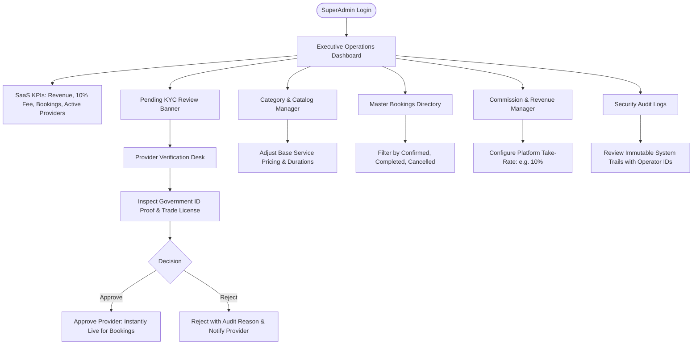

# QUICK APPOINTMENTS — ADMIN PANEL WORKFLOW

```mermaid
flowchart TD
    AdminLogin([SuperAdmin Login]) --> Dashboard[Executive Operations Dashboard]

    Dashboard --> Metrics[SaaS KPIs: Revenue, 10% Fee, Bookings, Active Providers]
    Dashboard --> KYCAlert[Pending KYC Review Banner]

    KYCAlert --> KYCCockpit[Provider Verification Desk]
    KYCCockpit --> InspectDocs[Inspect Government ID Proof & Trade License]
    InspectDocs --> Decision{Decision}
    Decision -- Approve --> MakeLive[Approve Provider: Instantly Live for Bookings]
    Decision -- Reject --> RecordReason[Reject with Audit Reason & Notify Provider]

    Dashboard --> CatalogManager[Category & Catalog Manager]
    CatalogManager --> DynamicPricing[Adjust Base Service Pricing & Durations]

    Dashboard --> BookingsLedger[Master Bookings Directory]
    BookingsLedger --> FilterStatus[Filter by Confirmed, Completed, Cancelled]

    Dashboard --> FinanceDesk[Commission & Revenue Manager]
    FinanceDesk --> RateSlider[Configure Platform Take-Rate: e.g. 10%]

    Dashboard --> AuditViewer[Security Audit Logs]
    AuditViewer --> InspectTrails[Review Immutable System Trails with Operator IDs]
```

