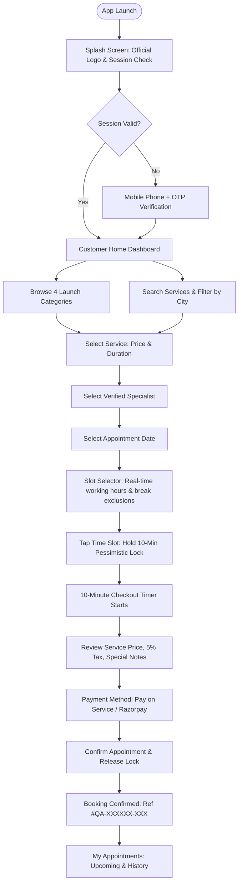

# QUICK APPOINTMENTS — CUSTOMER APP WORKFLOW

```mermaid
flowchart TD
    Launch([App Launch]) --> Splash[Splash Screen: Official Logo & Session Check]
    Splash --> AuthCheck{Session Valid?}
    AuthCheck -- No --> OTPAuth[Mobile Phone + OTP Verification]
    AuthCheck -- Yes --> Home[Customer Home Dashboard]
    OTPAuth --> Home

    Home --> Search[Search Services & Filter by City]
    Home --> ExploreCat[Browse 4 Launch Categories]
    ExploreCat --> ServiceDetail[Select Service: Price & Duration]
    Search --> ServiceDetail

    ServiceDetail --> SelectProvider[Select Verified Specialist]
    SelectProvider --> SelectDate[Select Appointment Date]
    SelectDate --> SlotMatrix[Slot Selector: Real-time working hours & break exclusions]
    
    SlotMatrix --> ReserveSlot[Tap Time Slot: Hold 10-Min Pessimistic Lock]
    ReserveSlot --> Countdown[10-Minute Checkout Timer Starts]
    
    Countdown --> OrderReview[Review Service Price, 5% Tax, Special Notes]
    OrderReview --> PaySelect[Payment Method: Pay on Service / Razorpay]
    PaySelect --> Confirm[Confirm Appointment & Release Lock]
    
    Confirm --> SuccessScreen[Booking Confirmed: Ref #QA-XXXXXX-XXX]
    SuccessScreen --> MyBookings[My Appointments: Upcoming & History]
```

