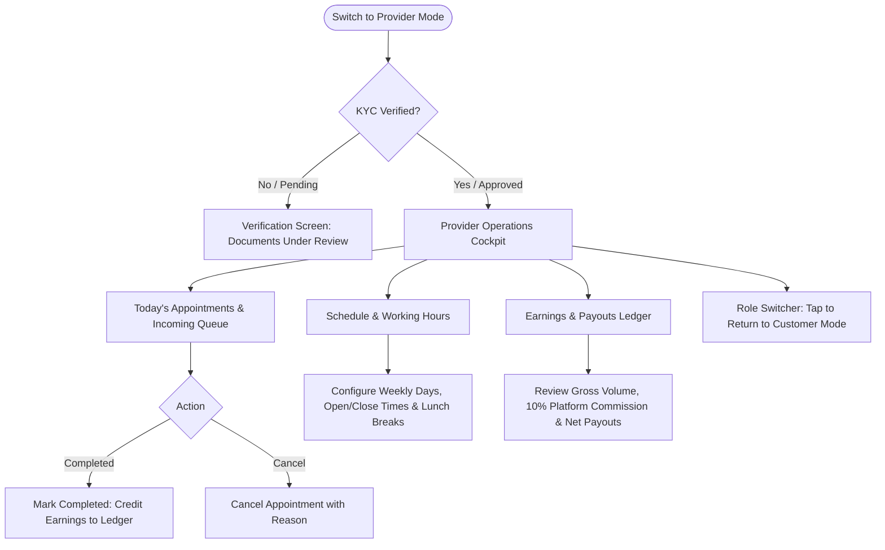

# QUICK APPOINTMENTS — PROVIDER APP WORKFLOW

```mermaid
flowchart TD
    ProviderEntry([Switch to Provider Mode]) --> CheckApproval{KYC Verified?}
    CheckApproval -- No / Pending --> VerificationWait[Verification Screen: Documents Under Review]
    CheckApproval -- Yes / Approved --> Cockpit[Provider Operations Cockpit]

    Cockpit --> LiveQueue[Today's Appointments & Incoming Queue]
    LiveQueue --> ActionDecision{Action}
    ActionDecision -- Completed --> MarkDone[Mark Completed: Credit Earnings to Ledger]
    ActionDecision -- Cancel --> MarkCancel[Cancel Appointment with Reason]

    Cockpit --> ScheduleSettings[Schedule & Working Hours]
    ScheduleSettings --> UpdateHours[Configure Weekly Days, Open/Close Times & Lunch Breaks]

    Cockpit --> EarningsDesk[Earnings & Payouts Ledger]
    EarningsDesk --> LedgerReview[Review Gross Volume, 10% Platform Commission & Net Payouts]

    Cockpit --> SwitchRole[Role Switcher: Tap to Return to Customer Mode]
```

